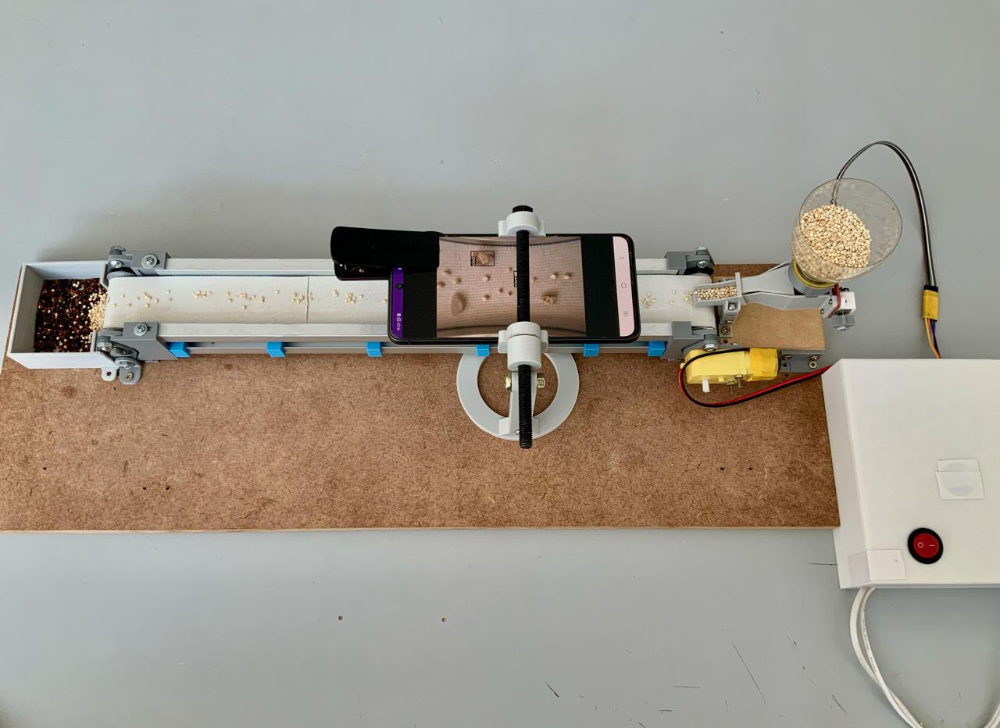

# QuinoaInspector 🌾
**Enabling Efficient Royal Quinoa Quality Inspection via Mobile-based Foreign Body Detection**

[](LICENSE)
[]()
[]()

<p align="center">
  
</p>

This repository provides the source code, dataset, and design files for a mobile-based system that enables the automatic detection of foreign bodies in royal quinoa.  

**Motivation**: The system aims to support Bolivian quinoa producers by reducing manual labour and improving inspection accuracy using computer vision and deep learning techniques. Royal quinoa, exclusive to the Bolivian altiplano, is highly nutritious but its production is limited by the lack of efficient methods for separating grains from impurities like straw and stones. This project presents a low-cost, mobile-based system using a conveyor belt, Android app, and a Xenvo Pro Lens Kit for close-up image capture. A YOLOv8s model trained on a custom dataset achieved an IoU of **0.89** for foreign body detection.  

## System Overview
The proposed system includes:
- An Android app for image capture and inference  
- A Xenvo Pro Lens Kit for enhanced visual detail  
- A conveyor belt and hopper system to automate grain movement  
- A YOLOv8s model trained to detect foreign bodies in quinoa


## Dataset
The dataset includes annotated images of quinoa grains and foreign bodies (straw, clods, stones). Format: YOLOv8. [Download the dataset](https://drive.google.com/file/d/1fAgeuET21HMf4vYWuqdvREwdbq6znlij/view?usp=sharing)

## Hardware Design
- Conveyor belt and hopper made from recyclable materials  
- Mobile tripod with fixed distance and angle  
- STL files available in `hardware/`

## Android App
- Capture images automatically as grains move  
- Send frames to the model
- App code in `app/`

## Model
We used [Ultralytics YOLOv8s](https://github.com/ultralytics/ultralytics) trained on our dataset.

- Intersection over Union (IoU): **0.89**  
- Lightweight for mobile deployment  
- Training and evaluation scripts are available in `notebooks/`

## 📖 Citation

If you find this work useful in your project, please use the following reference:

**IEEE format:**

\[1\] E. Salcedo, C. Huanca, and P. Patzi, “Enabling Efficient Royal Quinoa Quality Inspection via Mobile‑based Foreign Body Detection,” in *2024 IEEE Latin American Conference on Computational Intelligence (LA‑CCI 2024)*, 2024, doi:10.1109/LA‑CCI62337.2024.10814753. 

**BibTeX entry:**

```bibtex
@inproceedings{salcedo2024,
  author    = {Edwin Salcedo and Ciro Huanca and Pedro Patzi},
  title     = {Enabling Efficient Royal Quinoa Quality Inspection via Mobile‑based Foreign Body Detection},
  booktitle = {Proceedings of the 2024 IEEE Latin American Conference on Computational Intelligence (LA‑CCI 2024)},
  year      = {2024},
  doi       = {10.1109/LA‑CCI62337.2024.10814753},
}